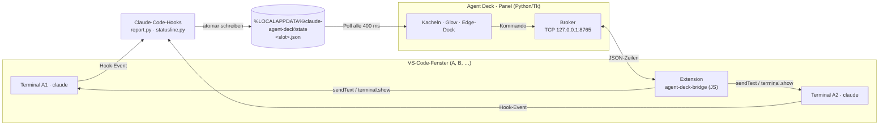

# Agent Deck

> Ein am Bildschirmrand angedocktes Dashboard für parallel laufende **Claude-Code-Agents**
> in VS Code. Eine Kachel je Chat, farbig nach Zustand — man sieht auf einen Blick,
> wer denkt, wer fertig ist und wer eine Rückfrage hat.


---

## Das Problem

Wer mehrere Claude-Code-Agents gleichzeitig laufen lässt, verliert den Überblick:
Welcher Chat wartet auf eine Freigabe? Welcher ist stehengeblieben? VS Code zeigt
Terminal-Tabs, aber keinen Zustand — und ein Klick auf den falschen Tab schickt
Text an den falschen Agenten.

Agent Deck löst das mit einem schmalen Panel, das am Bildschirmrand klebt und sich
bei Nichtgebrauch wegklappt. Jeder Chat ist eine Kachel; die Farbe ist der Zustand.
Klick auf die Kachel fokussiert **genau** dieses Terminal-Pane — ohne Fokus-Klau
und ohne Rätselraten.

## Architektur

Drei Prozesse, die sich über Dateien und einen TCP-Socket verständigen:



Warum diese Aufteilung:

| Aufgabe | Weg | Begründung |
|---|---|---|
| **Status** lesen | Claude-Code-Hooks → JSON-Datei | Hooks sind die einzige Quelle, die den echten Agent-Zustand kennt |
| **Pane** fokussieren | VS-Code-Extension | Win32/`SendInput` kann prinzipiell kein *einzelnes* Split-Pane treffen |
| **Fenster** nach vorn | Win32 `SetForegroundWindow` | die Extension kann ihr eigenes Fenster nicht aktivieren |
| Panel ↔ Extension | TCP, newline-getrennte JSON-Zeilen | kein Build-Step, keine Abhängigkeiten |

Das Wire-Vokabular liegt in [`protocol.py`](protocol.py). Es gibt bewusst keinen
Build-Step, darum spiegelt [`extension/extension.js`](extension/extension.js) die
Strings von Hand — wer dort etwas ändert, muss beide Seiten anfassen.

## Was drin steckt

- **Kachel je Chat**, Farbe = Zustand (idle · denkt · wartet auf dich · fertig · Verbindung verloren)
- **Ein Block je Repo**: Kopfzeile und Kachelreihe hängen sichtbar an derselben Schiene,
  und der Hover auf einer Karte lässt ihre Gruppe aufleuchten — bei mehreren offenen
  Repos die Frage, die man zuerst hat. Bewusst *keine* Farbe je Repo: der Farbkanal
  gehört dem Status
- **Am Rand andocken + Auto-Hide**: fährt auf Hover heraus, animiert über eine
  kritisch gedämpfte Feder (kein Overshoot bei randverankerten Panels)
- **Griff-Balken als Neon-Kapsel**: leuchtet in der Farbe des dringlichsten Status —
  man sieht bei zugeklapptem Deck, ob jemand etwas von einem will
- **Hover-Tooltip** mit KI-Kurzzusammenfassung des Chats (ein Satz, gecacht) plus
  selbst erkanntem Bezug: **Ticket** und **PR** per Regex aus dem Transcript, ohne Modellkosten.
  Darüber die Herkunft — Repo · Fenster · Slot, und bei Ticket-Arbeit der `worktree`, in
  dem der Agent wirklich sitzt (der ist sonst nirgends sichtbar)
- **Ticket → Worktree**: Ticket per Rechtsklick zuweisen, der Agent legt sich selbst
  einen `git worktree` an; beim Schließen der Kachel wird er wieder abgeräumt
- **Usage-Anzeige** des Kontos in der Bottom-Bar (Session · Woche · Modell-Woche),
  das Token wahlweise aus der Claude-Code-CLI oder aus Claude Desktop
- **Per-Monitor-DPI-V2**, damit auf 150 %-Displays nichts verwaschen wirkt
- **Drag & Drop** der Kacheln (VS Code gibt die Terminal-Reihenfolge nicht preis,
  also führt das Deck seine eigene)

## Voraussetzungen

| | |
|---|---|
| **Windows 10/11** | Das Deck ist Windows-only und wird es bleiben — es hängt an Win32 (Fensteridentität, `SetForegroundWindow`, Layered Windows, Per-Monitor-DPI). |
| **Python 3.12+** mit tkinter | Der Installer von python.org bringt tkinter mit; bei einer Store-Python kann es fehlen. |
| **VS Code** | Die Agenten laufen in dessen Terminals; das Deck spricht über eine kleine Extension mit ihnen. |
| **Claude Code CLI** | Angemeldet (`claude auth login`). Ohne sie gibt es nichts zu überwachen. |

Eine einzige Paket-Abhängigkeit: **Pillow** (Kachelflächen und Griff-Kapsel werden als
RGBA-Bilder komponiert). Alles andere ist Standardbibliothek — das ist Absicht und
soll so bleiben.

## Einrichtung

Vier Schritte, ausführlich in **[docs/SETUP.md](docs/SETUP.md)**:

```powershell
pip install -r requirements.txt

# 1. Extension in VS Code installieren (einmal pro Rechner)
$dst = "$env:USERPROFILE\.vscode\extensions\agent-deck-bridge"
New-Item -ItemType Directory -Force -Path $dst | Out-Null
Copy-Item ".\extension\*" $dst -Recurse -Force
# danach in jedem VS-Code-Fenster: "Developer: Reload Window"

# 2. Hooks in ~/.claude/settings.json eintragen  -> SETUP.md Schritt 2
# 3. Panel starten
.\start_debug.bat      # mit Konsole, für den ersten Start
.\start.bat            # leise (pythonw), danach

# 4. Im Panel auf "Fenster A" klicken, dann das VS-Code-Fenster anklicken
```

Schritt 2 ist der einzige mit Handarbeit: sechs Hook-Einträge, in denen der Pfad zu
`report.py` steht. Die Zuordnung aus Schritt 4 merkt sich das Deck in `bindings.json`.

Anfassen muss man sonst nur [`config.py`](config.py) — und auch das nur, wenn man die
Vorgaben ändern will (Jira-Projekt-Key, Startmodus neuer Agenten, Abschalter für
Tooltip-Zusammenfassung und Ticket-Erkennung).

## Was das Deck nach außen tut

Ein Dashboard, das fremde Prozesse beobachtet, sollte offenlegen, was es anfasst.
Vollständig:

| Was | Wann | Warum |
|---|---|---|
| Liest `~/.claude/.credentials.json` und Claude Desktops `config.json` | einmal beim Start, danach nur, wenn die API das Token abweist | um das eigene OAuth-Token für den Usage-Abruf zu bekommen (siehe unten) |
| Ruft `https://api.anthropic.com/api/oauth/usage` ab | alle 2 Min., solange die Usage-Anzeige an ist | die Prozentzahlen in der Bottom-Bar |
| Startet `claude -p --safe-mode --model haiku` als Unterprozess | je offener Session einmal **im Voraus** (nicht erst beim Hovern — sonst wartet man 10 s), danach nur bei echtem Zuwachs, frühestens alle 45 s | die Ein-Satz-Zusammenfassung im Tooltip. **Kostet Tokens** auf deinem Konto — Haiku und gecacht, also Cent-Beträge. `HOVER_SUMMARY_PREFETCH = False` erzeugt sie erst beim Hovern, `HOVER_SUMMARY = False` schaltet sie ganz ab |
| Öffnet einen TCP-Listener auf `127.0.0.1:8765` | solange das Panel läuft | Panel ↔ VS-Code-Extension. Nur localhost, keine Authentifizierung — wer lokal Code ausführen kann, kann darüber Text in deine Terminals schicken |
| Legt `git worktree`s an und löscht sie | nur bei Ticket-Zuweisung per Rechtsklick | damit sich parallele Agenten am selben Repo nicht in die Quere kommen |

Sonst geht nichts nach draußen: keine Telemetrie, kein Update-Check, keine Konten
außer deinem eigenen.

## Usage-Anzeige: woher die Zahlen kommen

Die Prozentzahlen in der Bottom-Bar (Session, Woche, Modell-Woche) kommen von
`https://api.anthropic.com/api/oauth/usage` — demselben Endpunkt, den auch die
Claude-Oberflächen benutzen. Zwei Dinge sollte man dazu wissen:

**Der Endpunkt ist nicht dokumentiert.** Er gehört Anthropic, nicht diesem Projekt,
und kann sich jederzeit ändern. Bricht er, zeigt das Badge „—" und sonst passiert
nichts — [`claude_usage.py`](claude_usage.py) ist durchgehend defensiv, ein Ausfall
kostet nie das Deck.

**Das Token kommt aus zwei Quellen**, beide werden gelesen und der Reihe nach
probiert:

1. **Claude Code CLI** — `~/.claude/.credentials.json`, Klartext-JSON. Der Normalfall:
   wer das Deck benutzt, hat die CLI zwingend installiert.
2. **Claude Desktop** — dessen `config.json`, verschlüsselt als Chromium-`v10`-Blob
   (AES-256-GCM, Schlüssel per Windows-DPAPI aus `Local State`). Entschlüsselt wird
   über Windows CNG (`bcrypt.dll`), damit keine Krypto-Abhängigkeit nötig ist.

Ist eins abgelaufen oder wird es mit 401 abgewiesen, trägt das andere weiter. Fehlen
beide, steht im Tooltip „Nicht angemeldet – `claude auth login`". **Claude Desktop ist
also nicht nötig** — die CLI allein genügt.

Das Token wird ausschließlich für diesen einen Abruf verwendet, nirgends
hingeschrieben und an niemanden sonst gesendet — es steht nur im Arbeitsspeicher des
Panels. Wer das nicht will, setzt `SHOW_USAGE = False` in
[`config.py`](config.py); dann wird keine der beiden Dateien je angefasst und das
Deck läuft ansonsten vollständig.

## Projektstruktur

Bewusst **flache Module ohne Package**: `restart()` startet sich über `sys.argv[0]`
neu, ein `python -m`-Layout würde das brechen.

<details>
<summary><b>Panel und Darstellung</b></summary>

| Datei | Aufgabe |
|---|---|
| `agent_deck.py` | Hauptfenster, Kachel-Aufbau, Refresh-Loop |
| `edge_dock.py` | Andocken am Rand, Auto-Hide, Slide-Animation, Griff |
| `handle_render.py` | Griff als freistehende Neon-Kapsel (Per-Pixel-Alpha) |
| `card_render.py` | Kachelfläche und Halo (Pillow, Masken-Cache) |
| `canvas_kit.py` | Palette, Zeichen-Primitive, pure Farb-/Text-Helfer |
| `glow_animator.py` | Puls, Crossfade, Bloom, Press-Pop |
| `bottom_bar.py` | Dauer-UI: Usage links, Einstellungen rechts |
| `hidpi.py` · `screen_fit.py` | DPI-Skalierung · Fenster im Monitor halten |
| `win_focus.py` | Win32: Fokus, Layered Windows, Fenster-Identität |

</details>

<details>
<summary><b>Kommunikation und Zustand</b></summary>

| Datei | Aufgabe |
|---|---|
| `broker.py` · `broker_commands.py` | TCP-Server · Fassade über die Wire-Dicts |
| `protocol.py` | Wire-Vokabular (die eine Quelle der Wahrheit) |
| `extension/` | VS-Code-Extension (reines JS, kein Build) |
| `report.py` · `statusline.py` | Claude-Code-Hooks (schreiben den Slot-Status) |
| `hookstate.py` | Slot-Auflösung über die Prozesskette |
| `status_model.py` | reine Statusinterpretation — ohne GUI testbar |
| `bindstore.py` · `deck_paths.py` | Bindings/Settings/Tickets · State-Ordner, atomares JSON |

</details>

<details>
<summary><b>Nebenaufgaben</b></summary>

| Datei | Aufgabe |
|---|---|
| `chat_summary.py` | Kurzzusammenfassung, Ticket-/PR-Erkennung |
| `claude_usage.py` | Usage-Abruf — Token aus CLI oder Claude Desktop (AES-GCM über Windows CNG, dependency-frei) |
| `claude_settings.py` | `~/.claude/settings.json` lesen |
| `worktree_cleanup.py` | verwaiste `git worktree`s abräumen |
| `single_instance.py` · `watchdog.py` | Zweitstart-Guard · Neustart-Wächter |
| `deck_log.py` | Logging (`pythonw` hat kein stderr) |
| `i18n.py` | Deutsch/Englisch |
| `reenable_glow.py` | Custom-CSS nach einem VS-Code-Update neu injizieren |

</details>

## Tests

Die anzeigefreie Logik ist unit-getestet — Statusmodell, Ticket-/PR-Erkennung,
Farb- und Text-Helfer, Worktree-Parsing, Usage-Auswertung, Watchdog-Urteile:

```powershell
python tests/run.py                   # alle 144 Tests, kein pytest nötig
python tests/test_dock_animation.py   # eine Datei allein läuft auch
python -m pytest tests/               # geht ebenfalls
```

Stand: **144/144** in 20 Dateien, die `deck/` spiegeln. Läuft in der
[CI](.github/workflows/ci.yml) bei jedem Push, dort zusammen mit einer Syntaxprüfung
aller Module (`python -m compileall`).

## Bekannte Grenzen

Ehrlicher als eine Feature-Liste — das hier ist der Stand, nicht ein Versprechen:

- **Nur Kacheln von Chats, die das Deck selbst angelegt hat, färben sich.** Die Farbe
  kommt von den Hooks, und die brauchen `AGENT_SLOT` in der Umgebung des Terminals.
  Von Hand gestartete Sessions erkennt die Extension zwar und man kann sie anklicken
  und steuern — sie bleiben aber grau.
- **`AskUserQuestion` und die Plan-Mode-Rückfrage melden keinen sauberen Hook.**
  Die Kachel zeigt dann nicht „wartet", obwohl der Agent wartet. Das ist die
  ärgerlichste offene Lücke.
- **Fenster-nach-vorn ist „best effort".** Windows verweigert `SetForegroundWindow`
  je nach Fokus-Situation und blinkt stattdessen nur den Taskbar-Button.
- **Der optionale Glow um das fokussierte Terminal patcht VS Codes `workbench.html`.**
  Deshalb warnt VS Code danach „Your Code installation appears to be corrupt", und
  jedes VS-Code-Update wirft den Patch wieder heraus (`python reenable_glow.py` holt
  ihn zurück). Wer das nicht will, lässt den Schritt in SETUP.md einfach aus — er ist
  optional und hat mit dem Deck selbst nichts zu tun.
- **Der Broker lauscht ohne Authentifizierung auf `127.0.0.1:8765`.** Für localhost
  ist das die übliche Abwägung, aber sie sei genannt.

## Ein verworfener .NET-Port

Der Commit `3fcddbc` enthält unter `src/` einen Portierungsversuch nach C#/.NET 9 mit
WPF. Er ist am 2026-07-29 verworfen worden, und die Lehre daraus ist notiert, weil sie
sich leicht wiederholen lässt: portiert und golden-getestet war die *Mathematik*
(Statusmodell, Andock-Rechnerei, Feder, Broker, Hooks) — es fehlte die *Zeichnerei*,
also genau das, was man sieht. Das Ergebnis sah entsprechend aus.

Python ist die einzige produktive Fassung.

## Lizenz

[MIT](LICENSE)
